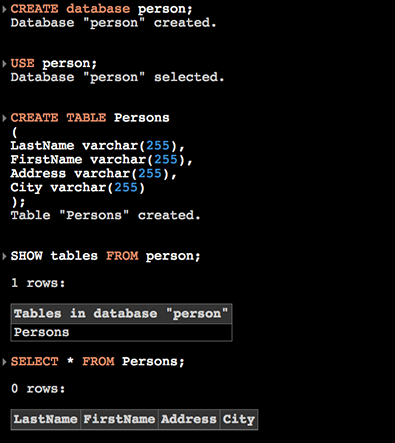



<h2 class="col">Generally</h2>
In recent years there is steady growth in the number of client-side applications. 
Javascript browser applications are much more faster than before.
Thanks to this nowadays there is a large number of web browser based applications. By increasing the number of these applications
many javascript libraries appeared.
Libraries which main goal is the web architecture. There is a good differentiation between data, logic and front-end.
<h2 class="col">ORM Based</h2>
JSSQL is a javascript based ORM system. ORM is programming technique for converting data between incompatible type systems in 
relational databases and object-oriented programming languages. This creates, in effect, 
a "virtual object database" that can be used from within the programming language. 
The ORM included with JSSQL provides a beautiful, simple ActiveRecord implementation for working with your 
database. Each database table has a corresponding "Model" which is used to interact with that table.

<h2 class="col">JSSQL Supports</h2>
JSSQL supports commands as "USE", "SHOW", "CREATE", "DROP", "INSERT" and "SELECT".

<h2 class="col">Why use JSSQL?</h2>
You finally got the tool which gives you the opportunity to work with sql and javascript in your browser.
You possess your own data in local storage.
It supports indexes and has a rich join support. It gives you the opportunity to merge javascript and sql and get a new language.
It is offline based application. You put your data in JSON files and they turn to you as a javascript objects.
Stand alone library without any dependencies. JSSQL is useful and easy to use javascript based sql engine.

<a href="jsdb-2.js.zip" id="download_button" download> Download </a>

